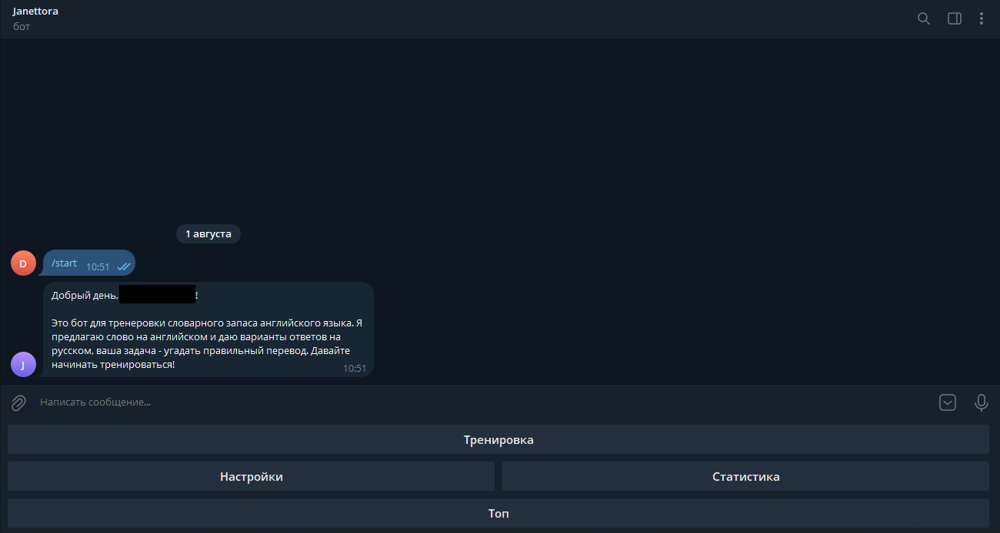
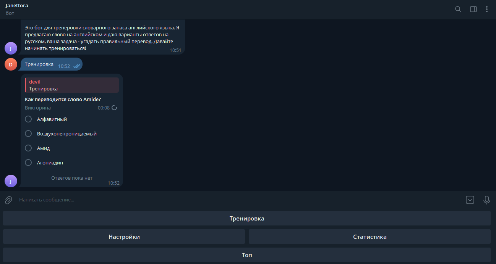
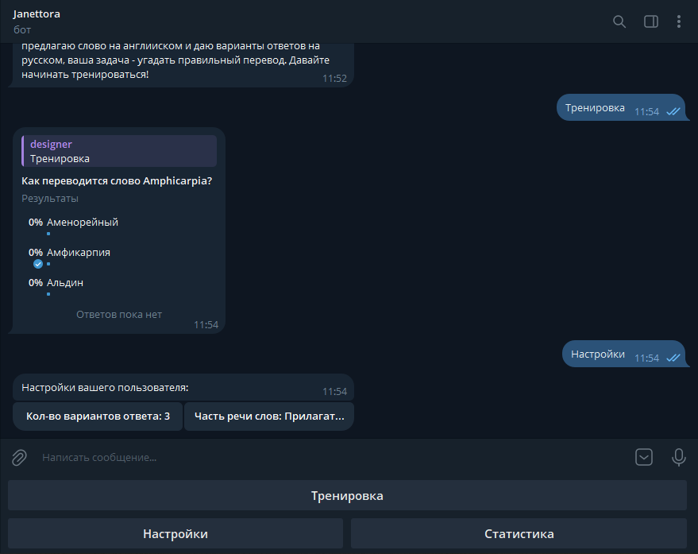
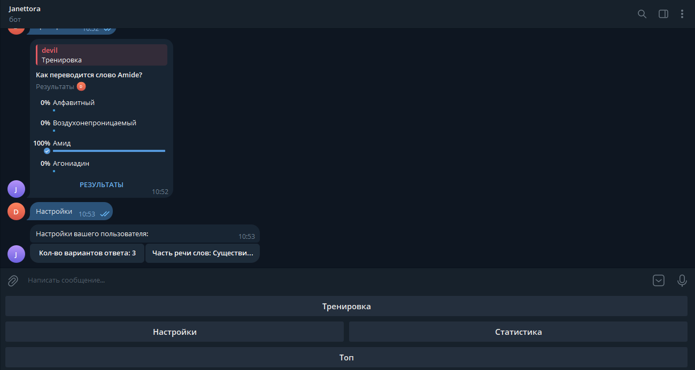
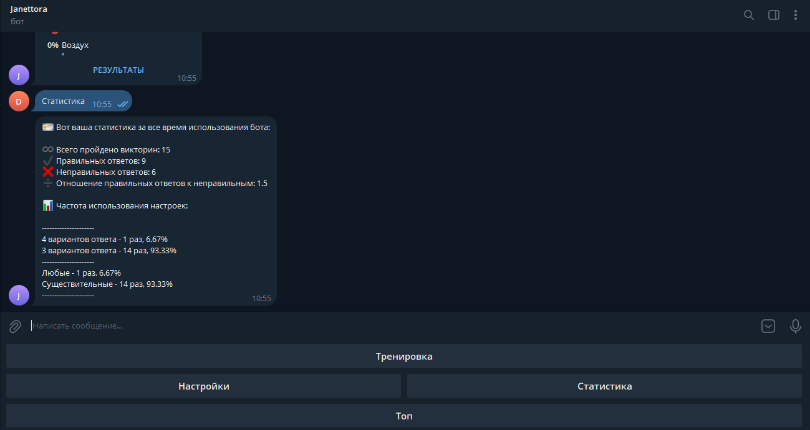

# Janettora  
Простой телеграм бот для тренировки словарного запаса английского языка, написанный на фреймворке 
__[Aiogram](https://github.com/aiogram/aiogram)__. Проект использует реляционную СУБД __[PostgreSQL](https://github.com/postgres/postgres)__ в качестве основной базы данных, 
нереляционную СУБД __[Redis](https://github.com/redis/redis)__ для кэширования, библиотечку __[loguru](https://github.com/Delgan/loguru)__ для логирования. Программа 
__[Docker](https://github.com/docker/compose)__'изирована. Используемый линтер и форматер кода - __[ruff](https://github.com/astral-sh/ruff)__.  

К боту `Janettora` встроены парсер сайта [worderdict.ru](https://www.worderdict.ru/) и некоторые маленькие CLI 
утилиты для управления базами данных.
  
__[Documentation in English](https://github.com/waflawe/Janettora/blob/main/README-en.md)__  

<!-- TOC --><a name="table-of-contents"></a>
## Карта контента 
- [Janettora](#janettora)
   * [Карта контента](#table-of-contents)
   * [Быстрый старт](#quick-start)
      + [Установка](#installation)
      + [Запуск в режиме локальной разработки](#run-in-local-development-mode)
      + [Запуск в продакшен режиме через Docker](#running-in-production-mode-via-docker)
   * [Функционал бота](#bot-functionality)
   * [Скриншоты](#screenshots)
   * [Описание настроек](#settings-description)
     + [Runtime настройки](#runtime-settings)
     + [Основная PostgreSQL база данных](#basic-postgresql-database)
     + [Основная Redis база данных](#main-redis-database)
     + [Исходная PostgreSQL база данных для Docker](#source-postgresql-database-for-docker)
     + [Исходная SQLite база данных для Docker](#source-sqlite-database-for-docker)
   * [Лицензия](#license)
<!-- TOC --><a name="quick-start"></a>
## Быстрый старт 
<!-- TOC --><a name="installation"></a>
### Установка
```commandline  
git clone https://github.com/waflawe/Janettora.git  
```  
После успешной установки вам нужно определиться с используемой базой данных слов. Она указывается программе 
по-разному в зависимости от режима запуска.
<!-- TOC --><a name="run-in-local-development-mode"></a>
### Запуск в режиме локальной разработки 
1. Установка зависимостей:
```commandline
pip install -r requirements/dev.txt
```
2. Создаем файл `.env` и заполняем его по примеру файла `.env.template`. Описание настроек [тут](#settings-description).
3. Для работы бота ему нужна база данных со словами, содержащая данные об их англоязычной, русскоязычной версиях и 
частях речи. Чтобы ее собрать для режима локальной разработки, у вас есть два предоставляемых программой пути:
    - __Быстрый путь__: вы можете воспользоваться небольшой, однако уже готовой базой в репозитории с именем 
   `test_words.db`. Она используется по умолчанию, если вы не переопределили в настройках (`.env`) переменную 
   `SQLITE_WORDS_DB_TO_DOCKER_NAME`. Для ее инициализации, введите команду `python database/cli/migrate_words.py` в 
   папке проекта. 
    - __Долгий алтернативный путь__: вы можете воспользоваться прикрепленным к боту парсером сайта 
   [worderdict.ru](https://www.worderdict.ru/), который соберет актуальные данные (пока его, конечно, не забанят на вашем IP) о словах в базу. 
   Для этого запустите команду `python parser/parser.py` из папки проекта.
4. Если `Redis` используется локальный, то запускаем отдельно два окна терминала. Иначе пропустите этот пункт. 
В первом запускаем `Redis`:
```commandline
redis-server
```
5. Во втором запускаем проект:
```commandline
python bot/bot.py
```
6. После продолжительного ожидания, заходим в бота, чей токен мы использовали в файле `.env`.
7. Наслаждаемся.
<!-- TOC --><a name="running-in-production-mode-via-docker"></a>
### Запуск в продакшен-режиме через Docker
1. Создаем файл `.env.docker` и заполняем его по примеру файла `.env.docker.template`. Описание настроек [тут](#settings-description).
2. Для работы бота ему нужна база данных со словами, содержащая данные об их англоязычной, русскоязычной версиях и 
частях речи. Чтобы ее собрать для продакшен-режима через Docker, у вас есть два предоставляемых программой пути:
    - __Быстрейший путь__: ничего не делать. Тогда вы воспользуетесь автоматически небольшой, однако уже готовой 
   базой в репозитории с именем `test_words.db`. Она используется по умолчанию, если вы не переопределили в настройках 
   (файл `.env.docker`) переменную `SQLITE_WORDS_DB_TO_DOCKER_NAME`.
    - __Долгий путь__: вы можете воспользоваться своей `PostgreSQL` базой слов, если  в ней табличка со словами в 
   правильном формате (это, например, может быть ранее используемая ботом база в режиме 
   [Запуск в режиме локальной разработки](#run-in-local-development-mode), тогда для вас настройки секции 
   [Исходная PostgreSQL база данных для Docker](#source-postgresql-database-for-docker) будут соответственно совпадать с настройками секции 
   [Основная PostgreSQL база](#basic-postgresql-database). Это, впринципе, самый частый случай). Если у вас есть такая база, вы можете создать 
   файл `.env`, если у вас еще он не создан, настроить по примеру `.env.template` (описание настроек [тут](#settings-description)) и, 
   после установления правильных значений секции настроек [Исходная PostgreSQL база данных для Docker](#source-postgresql-database-for-docker), запустить 
   команду `python database/cli/collect_words.py`. Команда сгенерирует `SQLite` базу с именем типа 
   `collect_words_{GENERATION_DATE}.db` в корне проекта. Затем впишите имя сгенерированной базы в переменную 
   `SQLITE_WORDS_DB_TO_DOCKER_NAME` в файле `.env.docker`.
3. Поднимаем Docker-compose:
 ```commandline
docker-compose up
```
4. После продолжительного ожидания, заходим в бота, чей токен мы использовали в файле `.env.docker`.
5. Наслаждаемся.
<!-- TOC --><a name="bot-functionality"></a>
## Функционал бота
В `Janettora` вы можете генерировать telegram-викторины, предлагающие угадать перевод английского слова на русский язык. 
При этом, настройка этих викторин довольно гибкая.

`Janettora` позволяет менять настройки своего аккаунта, такие как количество вариантов ответа в викторинах 
(`quiz_answers_count`) и части речи генерируемых в викторинах слов (`words_part_of_speech`). При изменении настройки 
`quiz_answers_count` дополнительно меняется время, дающееся на выполнение викторины. При использовании слов конретной 
части речи в настройке `words_part_of_speech` не только генерируемое слово на английском имеет установленную часть речи, 
но и все варианты ответа в викторине.

Так же `Janettora` умеет вести статистику пользователей, такую как общее число пройденных викторин, данные об успешности 
их прохождения (число верных/неверных ответов, их отношение), статистику о частоте генераций викторин с определенными 
настройками (например, сколько раз были сгенерированы викторины, с `quiz_answers_count` равном `3` и 
`words_part_of_speech` равном `Фразы`). 
<!-- TOC --><a name="screenshots"></a>
## Скриншоты 
1.   
2.   
3.   
4.   
5.   
<!-- TOC --><a name="settings-description"></a>  
## Описание настроек
<!-- TOC --><a name="runtime-settings"></a>
### Runtime-настройки
- __TELEGRAM_BOT_TOKEN__  
Обязательная для изменения настройка с телеграм токеном бота. Как его получить описано [здесь](https://tproger.ru/articles/telegram-bot-create-and-deploy#part1).  

- __DEBUG__  
Необязательная для изменения настройка, сигнализирующая важность ведения DEBUG логов (которые, кстати, ведутся в папке `.logs/`). `1` - `True`, `0` - `False`.

### Основная PostgreSQL база данных
- __DB_NAME__  
Не требующая изменения настройка, обозначающая имя основной `PostgreSQL` базы данных для бота.  

- __DB_USER__  
Имя пользователя базы.  

- __DB_PASSWORD__  
Пароль пользователя базы.  

- __DB_HOST__  
IP Адрес базы.  

- __DB_PORT__  
Порт на `DB_HOST` с базой.
### Основная Redis база данных
- __REDIS_HOST__  
IP Адрес базы.  

- __REDIS_PORT__  
Порт на `REDIS_HOST` с базой.  

- __REDIS_DB_NUMBER__  
Номер базы. `0`+  
### Исходная PostgreSQL база данных для Docker
Настройки для CLI утилиты `database/cli/collect_words.py`. Чаще всего совпадают соответственно с настройками раздела [Основная PostgreSQL база данных](), но не всегда.  
- __COLLECT_WORDS_DB_NAME__  
Имя базы.  

- __COLLECT_WORDS_DB_USER__  
Имя пользователя базы.  

- __COLLECT_WORDS_DB_PASSWORD__  
Пароль пользователя базы.  

- __COLLECT_WORDS_DB_HOST__  
IP Адрес базы.  

- __COLLECT_WORDS_DB_PORT__  
Порт на `DB_HOST` с базой.  
### Исходная SQLite база данных для Docker
- __SQLITE_WORDS_DB_TO_DOCKER_NAME__  
Имя `SQLite` базы данных в папке проекта с табличкой слов для Docker контейнера. По умолчанию используется база `test_words.db`, предоставляемая самим проектом. 
## Лицензия <a name="license"></a>
Этот проект лицензирован [MIT лицензией](https://github.com/waflawe/Janettora/blob/main/LICENSE).
